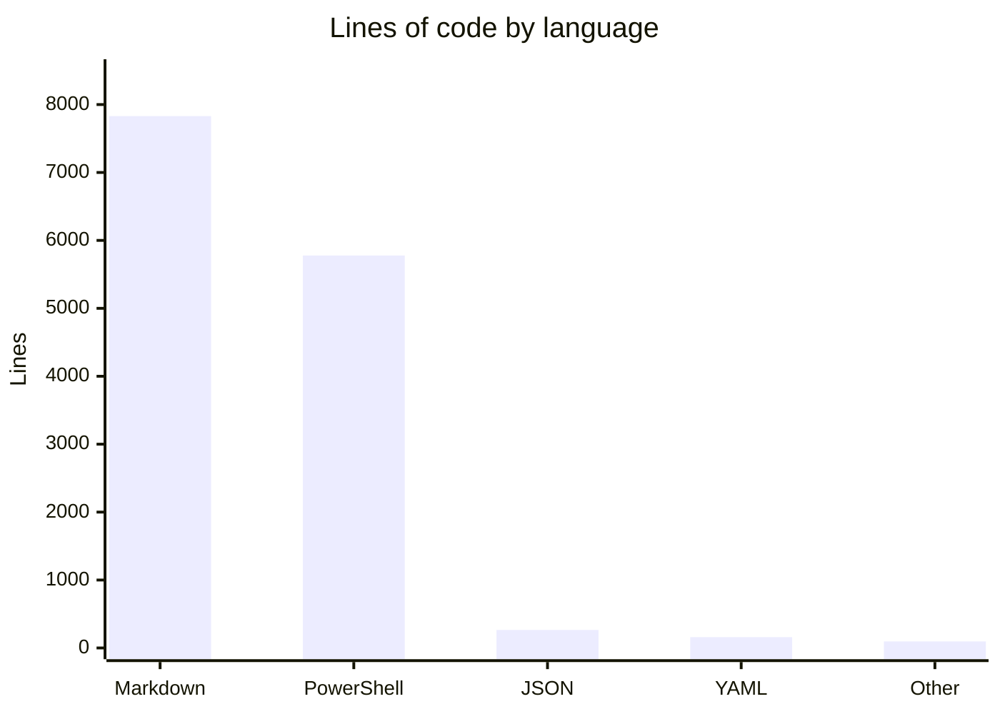

# By the numbers

A quantitative snapshot of the `intel-agency/agent-context` repository. All data was collected on 2026-07-25 from the default branch.

## Size

The repository contains 100 tracked files totaling roughly 13,400 lines across every language. Markdown dominates by volume, followed closely by PowerShell, which is the only programming language in the codebase.

### Source, test, and config breakdown

| Category | Files | Lines |
|---|---|---|
| PowerShell source scripts | 19 | ~2,988 |
| PowerShell test scripts (Pester) | 6 | ~2,790 |
| Markdown documentation | 60 | 7,830 |
| Config files (YAML, JSON, TOML, etc.) | 10 | ~434 |
| Other (gitignore, CODEOWNERS, workspace) | 5 | ~56 |

The test suite consists of 190 Pester tests achieving 93.91% line coverage. The test scripts are nearly as large as the production code they exercise, which reflects a deliberate decision to keep coverage above the 85% threshold enforced in CI.

## Activity

The repository saw 120 commits across two months. Work began on June 26, 2026 and the most recent commit landed on July 24, 2026.

### Commits per month

| Month | Commits |
|---|---|
| June 2026 | 23 |
| July 2026 | 97 |

July accounted for 81% of all commits. The burst corresponds to the introduction of the `gh-issue-tracking-init` skill and the readiness-hardening push that followed.

### Most actively changed files

These files were touched most often across the full commit history, indicating where the project's center of gravity sits.

| File | Times changed |
|---|---|
| `AGENTS.md` | 21 |
| `.agents/skills/gh-issue-tracking-init/SKILL.md` | 15 |
| `.agents/memory.md` | 11 |
| `GhIssueTracking.Tests.ps1` | 8 |
| `.agents/skills/.../scripts/common.ps1` | 7 |
| `.opencode/agents/orchestrator.md` | 6 |

### Most actively changed directories

| Directory | Total file touches |
|---|---|
| `.opencode/commands` | 40 |
| `.agents/skills/gh-issue-tracking-init/scripts` | 39 |
| `.opencode/agents` | 30 |
| `.agents/rules` | 25 |
| `.agents/skills/gh-issue-tracking-init` | 21 |

The `.opencode/commands` directory leads despite having most of its files deleted early on (see [Lore](lore.md)), because each removed file still counts as a touch. Among directories with surviving content, the `gh-issue-tracking-init` scripts directory is the most active.

## Bot-attributed commits

Of the 120 commits, 2 carry a `Co-authored-by` trailer referencing a bot account. That is 1.67% of all commits.

This number is a lower bound on AI-assisted work. Many commits were likely produced with AI assistance but do not carry the co-author trailer, so the true fraction of AI-assisted commits is almost certainly higher. The two explicitly co-authored commits both appear in the July readiness-hardening wave.

## Complexity

### Average file size by directory

| Directory | Avg lines/file | Files | Total lines |
|---|---|---|---|
| `.../scripts/tests` | 465 | 6 | 2,790 |
| `.../gh-issue-tracking-init/scripts` | 247 | 18 | 4,457 |
| `docs/plans/.completed` | 175 | 14 | 2,451 |
| `.agents` (all contents) | 170 | 40 | 6,830 |
| `scripts` (repo-root) | 151 | 8 | 1,214 |
| `docs/plans` | 130 | 24 | 3,139 |
| `.opencode` | 114 | 9 | 1,033 |

The test directory has the highest average file size at 465 lines per file, driven by comprehensive Pester test suites that mock GitHub API responses and exercise edge cases. The skill scripts average 247 lines, reflecting their focused, single-responsibility design.

### File count by type

| Type | Count |
|---|---|
| Markdown (`.md`) | 60 |
| PowerShell (`.ps1`) | 25 |
| YAML (`.yml`) | 5 |
| JSON with comments (`.jsonc`) | 2 |
| JSON (`.json`) | 2 |
| Other (TOML, txt, gitignore, etc.) | 6 |

Markdown accounts for 60% of all files. This is a documentation-heavy repository where the operating manual, rules files, skill definitions, and plan archives all live as Markdown. PowerShell is the only executable language, and every script is written for cross-platform PowerShell 7+ using the GitHub CLI.

---

See also: [agent-context overview](overview/index.md), [Architecture](overview/architecture.md), [Patterns and conventions](how-to-contribute/patterns-and-conventions.md), [gh-issue-tracking-init](features/gh-issue-tracking-init/index.md), [Lore](lore.md), [Fun facts](fun-facts.md).
