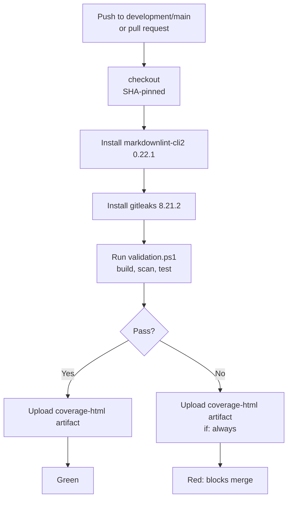

# Deployment

This repository is a GitHub template, not a deployed service. There is no application to deploy to a server or cloud platform. "Deployment" in this context means the CI pipeline that validates every change and the branch protection rules that govern what reaches the `development` and `main` branches. The CI standards live in `.agents/rules/ci-cd.md`.

## CI pipeline

The workflow file `.github/workflows/ci.yml` defines a single `validate` job that runs on `ubuntu-24.04`. It triggers on three events:

- Push to `development`
- Push to `main`
- Any pull request

The job runs `./validation.ps1` under PowerShell (`pwsh`), which executes the three validation steps: build, scan, and test. Before running validation, CI installs the two external tools that `validation.ps1` depends on:

- `markdownlint-cli2` at version 0.22.1 (via npm)
- `gitleaks` at version 8.21.2 (downloaded from GitHub releases)

After validation, CI uploads the `coverage-html/` directory as an artifact. The `if: always()` condition means the artifact is uploaded even when the validation step fails, so coverage reports are always available.

A typical CI run completes in about 32 seconds.

## SHA-pinned actions

Every `uses:` line in the workflow references a full 40-character commit SHA rather than a mutable tag. This is mandatory per `.agents/rules/ci-cd.md` because tag refs like `@v4` or `@main` are a supply-chain attack vector: a tag can be moved to point at malicious code without changing the workflow file.

The two actions used in this workflow:

| Action | SHA | Version comment |
|---|---|---|
| `actions/checkout` | `3d3c42e5aac5ba805825da76410c181273ba90b1` | `# v7.0.1` |
| `actions/upload-artifact` | `043fb46d1a93c77aae656e7c1c64a875d1fc6a0a` | `# v7.0.1` |

The trailing `# vX.Y.Z` comment is mandatory for readability so a reviewer can see the release version without looking up the SHA.

## Branch protection

A GitHub ruleset (id 19712997) protects both the `development` and `main` branches. The ruleset enforces:

- **1 approval** required before a pull request can merge.
- **Deletion blocked**: the protected branches cannot be deleted.
- **Non-fast-forward blocked**: force pushes that rewrite history are blocked.
- **Admin bypass**: repository admins can bypass the rules when needed.

This means no change reaches `development` or `main` without a passing CI run and at least one human approval. See [Security](security.md) for how this fits into the overall protection model.

## Related pages

- [Tooling](how-to-contribute/tooling.md) - what the validation steps check
- [Validation pipeline](systems/validation-pipeline.md) - build, scan, test in detail
- [Security](security.md) - branch protection, secret scanning, and CODEOWNERS
- [How to contribute](how-to-contribute/index.md) - the PR workflow that branches feed into
