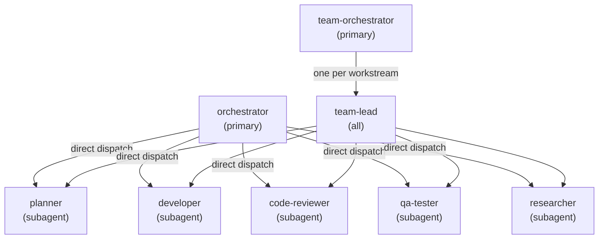

# Agent definitions

nam20485

The `.opencode/agents/` directory holds eight Markdown files, one per agent role. Each file has YAML frontmatter that pins the model, mode, temperature, and a permission grid, followed by a system prompt that defines the agent's behavior. Together they form a delegation hierarchy with two coordination layers and five specialists.

## The eight agents

| Agent | Mode | Role | When to use |
| --- | --- | --- | --- |
| `orchestrator` | primary | Top-level coordinator. Decomposes initiatives into a dependency graph, dispatches units to specialists, reassembles results. Cannot edit files. | Multi-step, multi-agent work. The default for non-trivial, multi-part tasks. |
| `team-orchestrator` | primary | Program-level coordinator. Splits a large initiative into parallel workstreams, delegates each to a team-lead, manages cross-team dependencies. Cannot edit files. | Multi-team efforts too big for a single team-lead. |
| `team-lead` | all | Workstream owner. Reviews the plan, assigns work to specialists, enforces the definition of done, reports status. Cannot edit files. | Running a single feature, epic, or fix as the accountable owner. |
| `planner` | subagent | Converts strategic goals into sequenced milestones with dependencies and acceptance criteria. Read-mostly; can write plan files only. | Before implementation, to scope and design an approach. |
| `developer` | subagent | Generalist engineer delivering small, surgical, well-tested code changes. Full edit access. | Implementing features, fixing bugs, scoped code changes. |
| `code-reviewer` | subagent | Rigorous reviews covering correctness, security, performance, and documentation. Read-only. | Reviewing PRs, diffs, or proposed changes. |
| `qa-tester` | subagent | Defines test strategies, writes and executes validation suites, enforces quality gates. Can edit test files. | Test authoring, regression coverage analysis, running or fixing failing test suites. |
| `researcher` | subagent | Background research agent. Surveys the web, docs, and external sources, returns distilled cited briefs. Read-only. | Best-practice surveys, competitive analysis, dependency or API research, factual questions needing current external information. |

## Delegation hierarchy

The rule from `.agents/rules/delegation.md` is simple: pick the smallest layer that fits the scope. Do not spawn a higher layer for work a lower one (or you directly) can handle.

There are two coordination paths. For single-team work, the `orchestrator` dispatches specialists directly in parallel batches, partitioned so no two agents write the same files. For multi-workstream programs, the `team-orchestrator` dispatches one `team-lead` per workstream, and each team-lead in turn dispatches its own specialists.

## The permission model enforces delegation

The coordinators are not just told to delegate; they physically cannot do the work themselves. Both `orchestrator` and `team-orchestrator` have `edit: deny` in their frontmatter, and their bash allow-list is read-only (git inspection, gh queries, ls, cat, rg). Any mutating call returns an immediate rejection. The `team-lead` has the same constraint.

The specialists have permissions scoped to their jobs. The `developer` has broad edit and bash access (it needs to run the toolchain). The `code-reviewer` and `researcher` are read-only by intent. The `qa-tester` can edit test files but asks before touching non-test code. The `planner` can write only to `.opencode/plans/` and `docs/plans/`.

A critical design choice in the coordinator frontmatter: the bash catch-all is `deny`, not `ask`. In a headless fire-and-forget dispatch, an `ask` permission prompt is unanswerable and deadlocks the run until a watchdog kills it. `deny` fails immediately and steers the coordinator to delegate instead. This is a universal design rule documented in the orchestrator frontmatter comments.

## Core loop shared by all coordinators

Every coordinator follows the same six-step loop, documented in `.opencode/agents/orchestrator.md`:

1. **Decompose** the initiative into small, well-scoped units with clear inputs, outputs, and a definition of done.
2. **Sequence** the units into a dependency DAG so independent work can run in parallel.
3. **Dispatch** each unit to the right specialist via the Task tool, batching independent calls.
4. **Track** progress with a TODO list, marking items in_progress when started and completed only when verified.
5. **Synthesize** the subagent results, resolve conflicts, and assemble the deliverable.
6. **Report** what each subagent did, overall status, tests run, and outstanding risks.

The guiding principle throughout is "verify, don't trust." A coordinator never marks a unit done on a subagent's say-so. It reads the diff or command output first-hand, or dispatches `code-reviewer` or `qa-tester` to validate.

## How agents reference project rules

Every agent's system prompt references `AGENTS.md` as the source of truth for conventions. The planning discipline, validation requirements, source control rules, and tool usage guidance all flow from the rules files under `.agents/rules/` through `AGENTS.md` into each agent definition. This keeps the agent prompts short while the rules remain centralized and editable in one place.

See [Memory and rules system](../systems/memory-and-rules.md) for how the rules directory is organized, and [Patterns and conventions](../how-to-contribute/patterns-and-conventions.md) for the conventions agents follow.

## Key source files

| Path | What it contains |
| --- | --- |
| `.opencode/agents/orchestrator.md` | Top-level coordinator definition |
| `.opencode/agents/team-orchestrator.md` | Program-level coordinator definition |
| `.opencode/agents/team-lead.md` | Workstream owner definition |
| `.opencode/agents/planner.md` | Planning specialist definition |
| `.opencode/agents/developer.md` | Implementation specialist definition |
| `.opencode/agents/code-reviewer.md` | Code review specialist definition |
| `.opencode/agents/qa-tester.md` | QA testing specialist definition |
| `.opencode/agents/researcher.md` | Research specialist definition |
| `.agents/rules/delegation.md` | Delegation and orchestration rules |

## Related pages

- [Features](index.md)
- [gap-miner-v2-tango57 overview](../overview/index.md)
- [Architecture](../overview/architecture.md)
- [Memory and rules system](../systems/memory-and-rules.md)
- [Validation pipeline](../systems/validation-pipeline.md)
