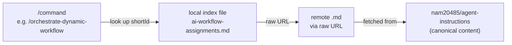

# AI instruction modules

nam20485

The `local_ai_instruction_modules/` directory at the repo root holds two index files that map shortIds to canonical instruction URLs in the remote `nam20485/agent-instructions` repository. They are the lookup tables the `/commands` system resolves against, and they are kept in sync with the remote by `scripts/update-remote-indices.ps1`.

## The two index files

| File | Remote directory | What it lists |
| --- | --- | --- |
| `local_ai_instruction_modules/ai-workflow-assignments.md` | `ai_instruction_modules/ai-workflow-assignments/` | All active workflow assignments (about 39 shortIds) |
| `local_ai_instruction_modules/ai-dynamic-workflows.md` | `ai_instruction_modules/ai-workflow-assignments/dynamic-workflows/` | All active dynamic workflows (17 shortIds) |

Each index entry provides four things for every shortId:

- **shortId** - the identifier a `/command` uses to look up the workflow
- **GitHub UI URL** - the browsable link to the `.md` file on GitHub
- **Raw URL** - the `raw.githubusercontent.com` link used to fetch the file content programmatically
- **Canonical file** - the path inside the remote repo

For example, the `orchestrate-dynamic-workflow` shortId in the workflow assignments index points to:

- GitHub UI: `https://github.com/nam20485/agent-instructions/blob/main/ai_instruction_modules/ai-workflow-assignments/orchestrate-dynamic-workflow.md`
- Raw URL: `https://raw.githubusercontent.com/nam20485/agent-instructions/main/ai_instruction_modules/ai-workflow-assignments/orchestrate-dynamic-workflow.md`
- Canonical file: `ai_instruction_modules/ai-workflow-assignments/orchestrate-dynamic-workflow.md`

## How shortId resolution works

The local index files are the authoritative **directory** of available shortIds. The remote repo is the authoritative **content**. When a `/command` like `/orchestrate-dynamic-workflow` or `/orchestrate-project-setup` runs, it follows this flow:



The `/command` reads the local index to find the shortId's raw URL, then fetches the remote `.md` to get the actual workflow instructions. Agents are instructed to resolve shortIds from the remote canonical repository and not use local mirrors, so the instructions are always current.

## How the indices are refreshed

The script `scripts/update-remote-indices.ps1` regenerates both index files from the remote repository's directory listings. It defaults to `-Owner nam20485 -Repo agent-instructions -Branch main` and can be run with no arguments:

```pwsh
pwsh ./scripts/update-remote-indices.ps1
```

The script calls the GitHub Contents API (`api.github.com/repos/$Owner/$Repo/contents/${Path}?ref=$Branch`) for each of the two remote directories, filters for `.md` files, sorts them by name, and builds the index content with the shortId, GitHub UI URL, raw URL, and canonical file path for each entry. It writes the rebuilt file only if the content actually changed, so a refresh with no upstream changes is a no-op.

If the `GITHUB_TOKEN` environment variable is set, the script includes it as a bearer token in the API request to avoid unauthenticated rate limits.

## Where the files live (do not relocate)

Both index files stay at the repo-root `local_ai_instruction_modules/` path. That path is hard-coded by `scripts/update-remote-indices.ps1` (it constructs the output path with `Join-Path $repoRoot 'local_ai_instruction_modules'`) and by the `/commands` that consume them. Moving these files into `.agents/` would require simultaneously updating both consumers. This constraint is documented in `.agents/rules/ai-instructions-modules.md`.

## Key source files

| Path | What it contains |
| --- | --- |
| `local_ai_instruction_modules/ai-workflow-assignments.md` | Workflow assignments index (shortId to URL mapping) |
| `local_ai_instruction_modules/ai-dynamic-workflows.md` | Dynamic workflows index (shortId to URL mapping) |
| `scripts/update-remote-indices.ps1` | Script that regenerates both index files from the remote repo |
| `.agents/rules/ai-instructions-modules.md` | Rules file documenting the remote canonical repo and refresh process |

## Related pages

- [Features](index.md)
- [Repository scripts](../systems/repo-scripts.md)
- [Memory and rules system](../systems/memory-and-rules.md)
- [Architecture](../overview/architecture.md)
- [Glossary](../overview/glossary.md)
