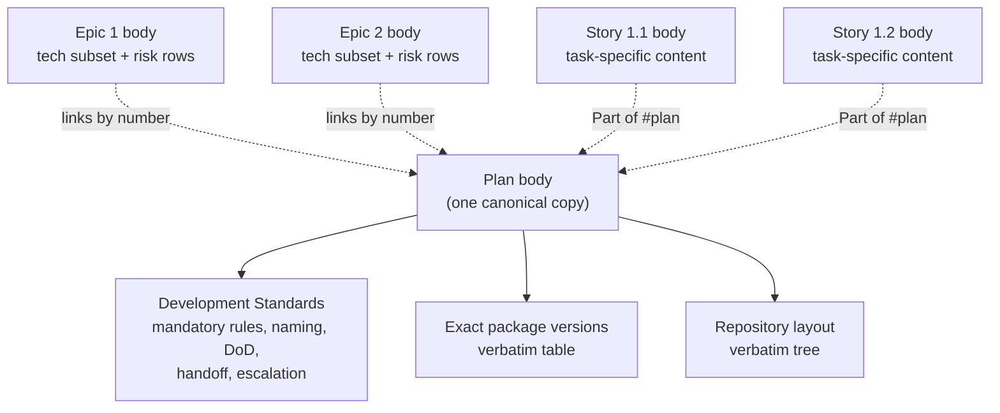
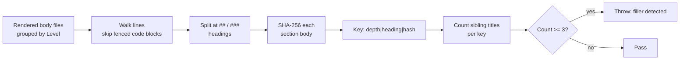

# Body composition

Active contributors: nam20485

The templates in `.agents/skills/gh-issue-tracking-init/assets/templates/` are skeletons. Their placeholders must be filled with plan-derived content, not agent-composed boilerplate. The body composition specification governs what lands where, and it is enforced at DryRun time. The single root cause of prior content-fidelity defects was that the skill left body composition to inference, and inference defaulted to filler. This page makes the contract explicit.

## The four templates

| Template | Level | Role |
|----------|-------|------|
| `application-plan.md` | Plan | Top-level issue holding cross-cutting standards, package versions, repository layout |
| `epic.md` | Epic | Per-phase issue with technology subset, risk rows, and a story list |
| `story.md` | Story | Per-task issue with implementation approach, acceptance criteria, validation plan |
| `task.md` | Task | Atomic sub-issue nested beneath a story when the plan has a fourth tier |

Every parent-issue body that enumerates child issues must carry numeric identifiers verbatim in each list entry: `Epic <N>:`, `Story <N>.<M>:`, or `Task <N>.<M>.<K>:`. Plain-text bullets without identifiers are never acceptable in child-issue lists. The templates carry `<!-- REQUIRED ... -->` reminders in each such section.

## Plan-content transfer manifest

Each row declares where a class of plan content must land, and at what fidelity. When the plan does not contain content for a row, omit the corresponding issue section entirely. Do not fabricate placeholder content.

| Plan element | Target issue | Fidelity |
|--------------|--------------|----------|
| Per-task inline code or config snippet | Story `Reference (from plan T-x.y)` fenced block | Verbatim with matching language tag |
| Per-task agent note (warning, verify-before-commit) | Story `Implementation Notes` | Verbatim |
| Per-task out-of-scope items | Story `Out of Scope` | Omit the subsection if the task has none specific |
| Cross-cutting mandatory rules and operating principles | Plan body `Development Standards` | Verbatim, one canonical copy |
| Naming and code conventions | Plan body `Development Standards` | Verbatim |
| Definition of Done | Plan body `Development Standards` | Verbatim |
| Handoff checklist and escalation protocol | Plan body `Development Standards` (last two subsections) | Verbatim |
| Exact package-version table | Plan body `Exact package versions` | Verbatim table, not summarized into prose |
| Repository file tree | Plan body `Repository layout` | Verbatim tree, not summarized into a 3-line summary |
| Risk-register rows | Epic `Risk Mitigation Strategies` plus Plan body full table | Split: each epic gets only rows whose mitigation references a task within it |
| Prompt-text catalog | The stories whose `Plan` section implements the prompt | Verbatim inside the story `Reference` fenced block |
| Parallel-execution map | Plan body (optional summary) | Summarized; blocked-by edges already encode dependencies structurally |
| Per-epic technology subset | Epic `Brief Technology Stack` | Only rows applicable to that epic; remove the rest |

## Filler prohibition

No two sibling issues (stories under the same epic, or epics under the same plan) may share a body section whose text is byte-identical unless that section is genuinely common cross-cutting content placed canonically on the Plan body.

Concretely, a story's `Plan`, `Implementation Notes`, `Validation Commands`, `Out of Scope`, and `Test Strategy` sections must differ in substance from the same sections in any sibling story. Phrases like "Implement per the AC", "Add tests", "dotnet build exit 0", or "CancellationToken / Never hardcode secrets" are filler when they repeat across stories.

An epic's `Brief Technology Stack` and `Risk Mitigation Strategies` must differ across epics. A 5-line stack block or a 2-row risk table that appears in every epic is filler, and in the case of cross-epic stack bleed (an "AI/Runtime" row on a non-AI epic) it is actively wrong.

When a section has nothing task- or epic-specific to say, omit the section entirely rather than paste boilerplate.

## Canonical cross-cutting content

Cross-cutting rules (mandatory rules, naming conventions, Definition of Done, handoff checklist, escalation protocol, exact versions, repository layout) live once on the Plan body's `Development Standards`, `Exact package versions`, and `Repository layout` sections. They are not copied into individual story or epic bodies. If a story needs to reference them, it links to the Plan issue by number (`Part of #<plan-issue>`); it does not re-paste the rules.

The dashed lines show the reference pattern: epic and story bodies link back to the Plan issue rather than duplicating its content.

## The DryRun filler detector

The filler prohibition is enforced at preview time by a SHA-256 hashing pass over rendered body files. The detector runs in the DryRun pass, before any `gh issue create` call, and throws on the first violation.

### How it works

The detector groups rendered bodies by level so siblings are only compared to siblings (stories against stories, epics against epics). For each body file it walks the lines, tracking fenced code blocks so that code content is not mistaken for headings, and splits the body into sections at `##` and `###` headings. For each section it computes a SHA-256 hash of the trimmed body text and builds a key of `depth|heading|hash`.

When three or more sibling issues share a byte-identical section body, the detector throws with the heading name and the offending issue titles. The error message instructs the caller to either omit the section where it has no sibling-specific content, or place common cross-cutting content canonically on the Plan body.

### Why the threshold is 3, not 2

Two sibling issues legitimately sharing a section is allowed. For example, two stories that both reference the same config fragment is a real pattern, not filler. Three or more siblings sharing byte-identical section text is a filler pattern: it means the section was pasted from a template rather than derived from the plan. Cross-cutting content that genuinely belongs in every issue must live once on the Plan body, as described above.

### The 16-character hash prefix

The detector uses the first 16 hex characters of the SHA-256 digest (`[BitConverter]::ToString($sha).Replace('-','').Substring(0,16)`). This is a collision-resistant shorthand for byte-identical comparison; the goal is exact-match detection, not fuzzy similarity, so a truncated hash is sufficient and keeps the comparison keys compact.

## Relationship to DryRun assertions

The filler detector is one of three DryRun assertions that run before any GitHub mutation. The other two, covered in [Orchestration](orchestration.md), are the title and milestone completeness check (every node must render a non-empty title, and epics and stories must have a non-empty milestone) and the secret scan via `assert-no-secrets.ps1` (described in [Operation scripts](operation-scripts.md)). Together they form a preview-time gate that catches omissions, filler, and credential leaks before they reach GitHub.

## Key source files

| File | Purpose |
|------|---------|
| `.agents/skills/gh-issue-tracking-init/SKILL.md` | Body composition specification, transfer manifest, filler detector source |
| `.agents/skills/gh-issue-tracking-init/assets/templates/story.md` | Story template with `Reference` and `Implementation Notes` placeholders |
| `.agents/skills/gh-issue-tracking-init/assets/templates/epic.md` | Epic template with tech subset and risk sections |
| `.agents/skills/gh-issue-tracking-init/assets/templates/application-plan.md` | Plan template holding canonical cross-cutting content |
| `.agents/skills/gh-issue-tracking-init/scripts/assert-no-secrets.ps1` | Secret scanner run alongside the filler detector in DryRun |
