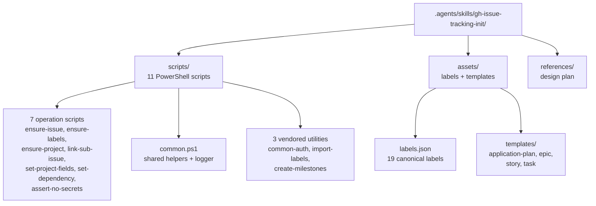
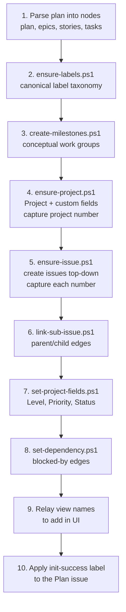

# gh-issue-tracking-init

Active contributors: nam20485

The `gh-issue-tracking-init` skill is the repository's primary product. It scaffolds a GitHub issue-based planning hierarchy from a plan document, turning a single Markdown file into a tree of linked sub-issues plus a Projects v2 board, milestones, and labels. The hierarchy has four levels: plan, epic, story, and task, connected by GitHub sub-issue links, with dependency edges recorded through the issue-dependencies API.

The skill itself decides **what** to create from the plan. The actual work is done by idempotent PowerShell operation scripts that the skill composes into a single orchestration driver. Every script supports `-DryRun` and matches existing resources before creating, so re-running the skill after editing a plan syncs additions and changes without duplicating anything.

## Self-contained architecture

The skill lives entirely under `.agents/skills/gh-issue-tracking-init/` and has no dependency on anything outside that directory. Copy the directory into another repo and it works unmodified.

The three vendored scripts (`common-auth.ps1`, `import-labels.ps1`, `create-milestones.ps1`) are general-purpose GitHub CLI helpers. They exist both inside the skill directory and at the repository root, because they are useful beyond this skill. The skill ships its own copies so it remains self-contained. See [Repository scripts](../../systems/repo-scripts.md) for the root-level originals.

## Prerequisites

- PowerShell 7+ (`pwsh`).
- GitHub CLI (`gh`) authenticated with the `project` scope. `$GITHUB_TOKEN` is honored by `gh`.
- Run everything from the repository root.
- Preview with `-DryRun` before applying.

See [Getting started](../../overview/getting-started.md) for environment setup details.

## Inputs

Both inputs are optional and default to the repository the skill runs from:

- `$ghrepo` - target repository as `owner/repo`. When omitted, the skill resolves it from the current working directory via `gh repo view --json nameWithOwner`.
- Plan source - a filled plan document or the user's description. When omitted, the skill resolves `plan_docs/**/*.md` non-interactively using filename role classification:
  - **Primary plan** (slugs like `development-plan`, `app-plan`, `implementation-spec`) becomes the issue tree.
  - **Architecture** documents become context folded into the Plan body and relevant epic bodies.
  - **Reference** documents (everything else) become context in the Plan body only.

The only case that prompts the user is an empty or missing `plan_docs/` with no plan supplied. Everything else resolves automatically; the skill never asks the user to choose between plan docs.

## Plan to hierarchy mapping

Plan documents rarely use the words "epic", "story", or "task" verbatim. They organize work under their own top-level groupings, and mapping those groupings onto the four levels is the single most load-bearing decision in a run:

- The whole plan becomes one Plan issue.
- The plan's top-level work groups become Epics. These are frequently titled "Phases" (Phase 0, Phase 1, and so on) but the same role is played by Sprints, Stages, Groups, or Pillars. A plan whose top layer is Phases must be treated as one Epic per Phase.
- The plan's leaf work items become Stories. These are the atomic, independently-completable units the plan numbers as tasks.
- Tasks (the fourth level) are introduced only when the plan itself nests a sub-tier beneath its leaf items. A plan structured as Group then Item has no task level; its Stories are leaves, and that is correct, not a gap.

When the plan keys its dependency graph by an id (for example a Parallel Execution Map referencing `T-x.y`), that id should surface on the corresponding issue title so the plan-to-issue mapping is self-documenting.

## The 10-step orchestration flow

The skill works top-down and always runs a `-DryRun` pass first. Before the steps below, it initializes a forensic logfile that mirrors every `gh` call and status line for post-execution debugging.

1. **Parse the plan** into a tree of nodes with numbered titles, per-node labels, milestone, phase, priority, estimate, and blocking dependencies. Assert the canonical node schema before rendering.
2. **Labels** - `ensure-labels.ps1 -Repo $ghrepo` creates the 19-label taxonomy from `assets/labels.json`.
3. **Milestones** - `create-milestones.ps1 -Repo $ghrepo -Titles <name> -SkipExisting` for each conceptual work group.
4. **Project and fields** - `ensure-project.ps1 -Owner <owner> -Repo $ghrepo [-Phases <p1,p2>]` creates the Projects v2 board with `Level`, `Priority`, `Estimate`, and optional `Phase` fields. The project number is printed to stdout and captured for later steps.
5. **Create issues** top-down with `ensure-issue.ps1`, filling the matching template into a temp file and passing `-BodyFile`. Capture each printed issue number. Apply the level label and, for epics and their descendants, the milestone.
6. **Link sub-issues** with `link-sub-issue.ps1 -ParentNumber <parent> -ChildNumber <child>` for every parent/child edge.
7. **Set board fields** with `set-project-fields.ps1` for each issue: `Level`, `Priority`, `Phase` (if used), `Estimate`, and `Status` (default `Todo`).
8. **Dependencies** - for each blocked-by edge, `set-dependency.ps1 -IssueNumber <blocked> -BlockedByNumber <blocker>`.
9. **Views** - `ensure-project.ps1` prints four views to add in the Project UI (not automatable): By Phase, By Status, By Epic, Current work.
10. **Signal completion** - on a successful apply run, apply the `gh-issue-tracking:init-success` label to the Plan issue. This is the hand-off signal a downstream orchestrator matches to learn the hierarchy is ready.

For the script-by-script reference, see [Operation scripts](operation-scripts.md). For how the skill composes these scripts into a single driver and the DryRun assertions it enforces, see [Orchestration](orchestration.md). For the rules governing what content lands in each issue body, see [Body composition](body-composition.md).

## Key source files

| File | Purpose |
|------|---------|
| `.agents/skills/gh-issue-tracking-init/SKILL.md` | Full skill definition, conventions, and orchestration contract |
| `.agents/skills/gh-issue-tracking-init/scripts/README.md` | Scripts documentation with smoke test walkthrough |
| `.agents/skills/gh-issue-tracking-init/scripts/common.ps1` | Shared helpers: logger, auth bootstrap, `Invoke-Gh` wrapper, id lookups |
| `.agents/skills/gh-issue-tracking-init/assets/labels.json` | Canonical 19-label taxonomy |
| `.agents/skills/gh-issue-tracking-init/assets/templates/` | Four issue body templates (plan, epic, story, task) |
