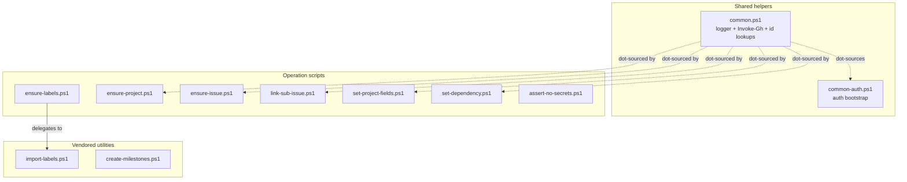

# Operation scripts

Active contributors: nam20485

The `gh-issue-tracking-init` skill does its work through 11 PowerShell scripts in `.agents/skills/gh-issue-tracking-init/scripts/`. There is one script per operation, and the skill orchestrates them. Every script is idempotent and supports `-DryRun`. The scripts fall into three groups: seven operation scripts that perform GitHub mutations, one shared helper module, and three vendored utilities copied from the repository root so the skill stays self-contained.



The dotted lines show dot-source relationships: every operation script pulls in `common.ps1`, which in turn pulls in `common-auth.ps1`. The solid line shows the one delegation call, where `ensure-labels.ps1` invokes `import-labels.ps1`. `assert-no-secrets.ps1` is the exception: it is a pure file scanner with no `gh` dependency and does not dot-source `common.ps1`.

## Script inventory

| Script | Group | Purpose | Key parameters |
|--------|-------|---------|----------------|
| `common.ps1` | Shared helpers | Logger, auth bootstrap, mockable `Invoke-Gh` wrapper, owner/repo parsing, DB-id lookups | dot-sourced, not called directly |
| `common-auth.ps1` | Vendored utility | GitHub CLI auth check and login bootstrap | dot-sourced by other scripts |
| `import-labels.ps1` | Vendored utility | Create, update, or delete labels from a JSON file | `-Repo -LabelsFile [-DryRun] [-DeleteMissing]` |
| `create-milestones.ps1` | Vendored utility | Create milestones from titles or a titles file | `-Repo -Titles [-TitlesFile] [-SkipExisting] [-DryRun]` |
| `ensure-labels.ps1` | Operation | Ensure the canonical label taxonomy exists (delegates to `import-labels.ps1`) | `-Repo [-LabelsFile] [-DryRun]` |
| `ensure-project.ps1` | Operation | Create and link the Projects v2 board with custom fields; prints the project number to stdout | `-Owner -Repo [-Title] [-Phases] [-DryRun]` |
| `ensure-issue.ps1` | Operation | Create or update one issue from a template body; prints the issue number to stdout | `-Repo -Title (-Body\|-BodyFile) [-Labels -Milestone -Assignee -UpdateBody] [-DryRun]` |
| `link-sub-issue.ps1` | Operation | Attach a child issue as a sub-issue of a parent | `-Repo -ParentNumber -ChildNumber [-DryRun]` |
| `set-project-fields.ps1` | Operation | Add an issue to the board and set Level, Priority, Phase, Status, Estimate | `-Owner -ProjectNumber -Repo -IssueNumber [-Level -Priority -Phase -Status -Estimate] [-DryRun]` |
| `set-dependency.ps1` | Operation | Record a blocked-by relationship between two issues | `-Repo -IssueNumber -BlockedByNumber [-DryRun]` |
| `assert-no-secrets.ps1` | Operation | Scan rendered body files for secrets before issue creation; throws on confident detection | `-BodyFiles [-DryRun]` |

## Shared helpers: `common.ps1`

Every operation script begins with `. (Join-Path $PSScriptRoot 'common.ps1')`. This module provides the foundation the rest of the scripts build on:

- **`Initialize-LogFile`** - creates a per-run forensic logfile at `<repo-root>/gh-init-<slug>-<UTC-timestamp>.log` and stores its path in `$env:GHIT_LOG_FILE`. The header records the repository identity, working-copy path, git rev and ref, script directory, and OS/PowerShell version.
- **`Write-Log`** - appends a timestamped, operation-tagged line to the logfile. Silent no-op when no logfile is set, so scripts can call it unconditionally.
- **`Invoke-Gh`** and **`Invoke-GhJson`** - central wrappers around `gh` so every call is mockable in Pester tests and mirrored to the logfile. They throw on non-zero exit.
- **`Get-RepoParts`** - splits an `owner/repo` string into its parts with validation.
- **`Get-IssueDbId`** - resolves an issue's numeric database id (required by the sub-issues and dependencies APIs, which key off the database id, not the issue number). Casts to `[long]` because GitHub global database IDs now exceed `Int32.MaxValue`.
- **`Find-IssueNumberByTitle`** - exact-title lookup across open and closed issues using the paginated REST endpoint, excluding pull requests. This is how `ensure-issue.ps1` achieves idempotency.
- **`Write-Step`, `Write-Ok`, `Write-Skip`, `Write-DryRun`** - color-coded status helpers that also log to the forensic file.

`common-auth.ps1` is dot-sourced by `common.ps1` and provides `Initialize-GitHubAuth`, which verifies `gh` is on PATH and triggers `gh auth login` when not authenticated.

## Vendored utilities

Three scripts are vendored copies of general-purpose repo-root utilities, kept inside the skill so it has no external dependencies:

- **`import-labels.ps1`** reads a JSON label export and creates, updates, or (with `-DeleteMissing`) deletes labels to match. It normalizes colors, compares descriptions, and builds an action plan before applying anything. Called by `ensure-labels.ps1`.
- **`create-milestones.ps1`** creates milestones from a title array or a titles file. With `-SkipExisting` it silently skips milestones that already exist by title. Supports state, description, and due-date options.
- **`common-auth.ps1`** provides the auth bootstrap described above.

The originals live at the repository root under `scripts/`. See [Repository scripts](../../systems/repo-scripts.md) for those.

## Operation scripts in orchestration order

The seven operation scripts run in a fixed top-down order during a hierarchy build. Each prints a machine-readable result to stdout that the orchestration driver captures.

### `ensure-labels.ps1` (step 2)

Ensures the 19-label canonical taxonomy from `assets/labels.json` exists in the target repo. It delegates entirely to the vendored `import-labels.ps1`, which creates missing labels and updates color or description when they differ. Workflow state (Todo, In Progress, Done) is intentionally absent from labels because it lives in the Project Status field.

### `ensure-project.ps1` (step 4)

Creates the Projects v2 board if it does not exist, links it to the repo, and ensures the custom fields: `Level` (single-select: plan, epic, story, task), `Priority` (single-select: P0 to P3), `Estimate` (number), and optionally `Phase` (single-select, only when `-Phases` is supplied). The project number is written to stdout so the driver can capture it with `$Proj = & ensure-project.ps1 ...`. In `-DryRun` the project is not created, so nothing is emitted and the number is `$null`.

### `ensure-issue.ps1` (step 5)

The core creation script. It looks for an existing open or closed issue with an exact title match. If not found, it creates the issue with the supplied body, labels, milestone, and assignees. If found, it updates labels and milestone, and overwrites the body only when `-UpdateBody` is passed (off by default so re-runs do not clobber manual edits). On success the issue number is written to stdout. The body comes from a filled template passed via `-BodyFile`.

### `link-sub-issue.ps1` (step 6)

Attaches a child issue as a sub-issue of a parent using the REST API `POST /repos/{owner}/{repo}/issues/{parent}/sub_issues`. The API keys off the child's numeric database id, not its number, so the script calls `Get-IssueDbId` to resolve it. Idempotency is checked first by listing existing sub-issues and skipping if the child is already attached.

### `set-project-fields.ps1` (step 7)

Adds an issue to the Project board (a no-op if already present) and sets single-select fields by matching option names, plus the numeric Estimate. It uses `$PSBoundParameters.ContainsKey(...)` rather than `$null -ne $X` guards to distinguish unbound string parameters from explicitly empty values, which avoids spurious "field not found" warnings.

### `set-dependency.ps1` (step 8)

Records a blocked-by relationship using the REST API `POST /repos/{owner}/{repo}/issues/{issue}/dependencies/blocked_by`. Like `link-sub-issue.ps1`, it resolves the blocking issue's database id via `Get-IssueDbId` and checks for an existing relationship before creating one.

### `assert-no-secrets.ps1` (DryRun gate)

Not part of the numbered steps but run as a DryRun assertion before any `gh issue create` call. It scans rendered body files for credential-shaped content across three tiers: format-specific token patterns (AWS, GitHub, OpenAI, Stripe, Google, Slack, GitLab, JWT, private keys), connection strings with embedded credentials, and credential-keyed assignments. It throws on confident detection and halts the run. A value-level allowlist recognizes placeholders like `${VAR}`, `changeme`, and `<YOUR_API_KEY>` so plan docs that use interpolation do not false-positive. See [Body composition](body-composition.md) for where this fits the DryRun contract.

## Idempotency

Re-runs are safe across all scripts. Labels are matched by name, milestones by title, issues by exact numbered title, sub-issue links by parent/child pair, and dependencies by the blocked-by pair. Everything is skipped or updated, never duplicated. This is what makes re-running the skill after editing a plan a sync operation rather than a rebuild. See [Patterns and conventions](../../how-to-contribute/patterns-and-conventions.md) for the repo-wide idempotency principles.

## Testing

The Pester suite lives in `.agents/skills/gh-issue-tracking-init/scripts/tests/` and covers the `common.ps1` helper logic (with `gh` mocked), the label taxonomy, per-script contracts, and self-containment checks. It performs no repo mutation.

```pwsh
Invoke-Pester -Path .agents/skills/gh-issue-tracking-init/scripts/tests -Output Detailed
```

A full end-to-end smoke test against a throwaway repo is documented in `.agents/skills/gh-issue-tracking-init/scripts/README.md`. See [Getting started](../../overview/getting-started.md) for running the broader test suite.

## Key source files

| File | Purpose |
|------|---------|
| `.agents/skills/gh-issue-tracking-init/scripts/common.ps1` | Shared helpers: logger, `Invoke-Gh` wrapper, id lookups, status writers |
| `.agents/skills/gh-issue-tracking-init/scripts/ensure-issue.ps1` | Idempotent issue create or update by exact title match |
| `.agents/skills/gh-issue-tracking-init/scripts/ensure-project.ps1` | Projects v2 board creation, field setup, project number emission |
| `.agents/skills/gh-issue-tracking-init/scripts/set-project-fields.ps1` | Board item add and single-select field assignment |
| `.agents/skills/gh-issue-tracking-init/scripts/assert-no-secrets.ps1` | Three-tier secret scanner, throw-and-halt on detection |
