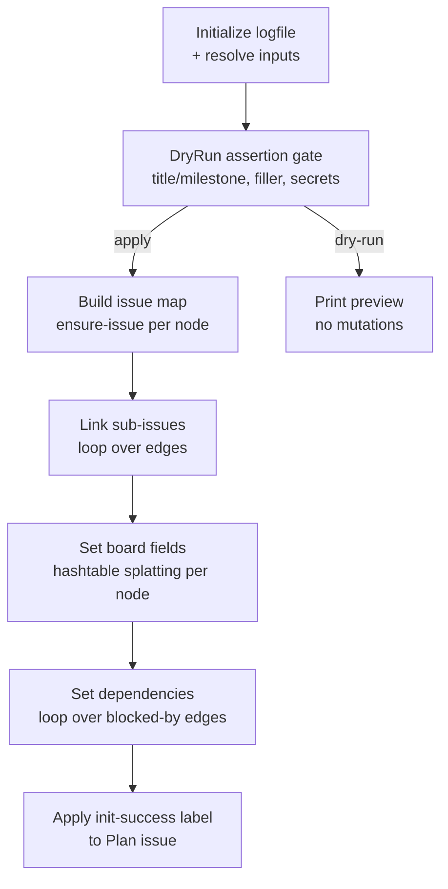

# Orchestration

Active contributors: nam20485

The `gh-issue-tracking-init` skill does not run its operation scripts one at a time across separate LLM turns. It composes a single PowerShell driver script that builds an issue map once, then loops through the operations in dependency order. This page covers the orchestration strategy, the DryRun assertion gate, and the scratch workspace isolation that keeps runs clean.

## Compose a single driver, not one op per turn

Invoking each operation script as its own LLM turn (one script per reasoning step) has been measured at roughly 77 minutes for the first 40 percent of a 30-issue hierarchy. The per-turn overhead dominates the actual REST calls. Instead, the skill composes a single PowerShell orchestration script that captures issue numbers into a map and drives the remaining operations in tight loops:

```pwsh
$map = @{}
foreach ($n in $nodes) {
    $map[$n.title] = & "$Skill/ensure-issue.ps1" -Repo $ghrepo -Title $n.title `
        -BodyFile $n.bodyFile -Labels $n.labels -Milestone $n.milestone
    Start-Sleep -Milliseconds 500
}
foreach ($e in $edges) {
    & "$Skill/link-sub-issue.ps1" -Repo $ghrepo -ParentNumber $map[$e.parent] -ChildNumber $map[$e.child]
    Start-Sleep -Milliseconds 500
}
foreach ($n in $nodes) {
    $ht = $n.fields
    & "$Skill/set-project-fields.ps1" @ht
    Start-Sleep -Milliseconds 500
}
foreach ($d in $deps) {
    & "$Skill/set-dependency.ps1" -Repo $ghrepo -IssueNumber $map[$d.blocked] -BlockedByNumber $map[$d.blocker]
    Start-Sleep -Milliseconds 500
}
```

The 500-millisecond sleep between REST-mutating calls avoids GitHub's secondary rate limits. The issue map (`$map`) is built once during issue creation, then reused for linking, field assignment, and dependencies.



## Hashtable splatting for `set-project-fields.ps1`

`set-project-fields.ps1` binds parameters by name. When composing calls, use hashtable splatting (`@ht`), never array splatting (`@a` of a `string[]`). Array splatting is positional and will misbind parameter names, which was the one call-site bug observed in a prior forensic run:

```pwsh
# Correct: hashtable splatting
$ht = @{
    Owner         = $Owner
    ProjectNumber = $Proj
    Repo          = $ghrepo
    IssueNumber   = $n.number
    Level         = 'story'
    Status        = 'Todo'
    Priority      = 'P1'
    Phase         = 'X'
}
& "$Skill/set-project-fields.ps1" @ht

# Wrong: array splatting is positional and misbinds names
$a = @($Owner, $Proj, $ghrepo, $n.number, 'story', 'Todo', 'P1', 'X')
& "$Skill/set-project-fields.ps1" @a   # parameters land on wrong slots
```

## Avoid integer-keyed lookup dictionaries

PowerShell integer-keyed `[ordered]@{}` and `@{}` indexing is unreliable for some keys. This was reproduced on PowerShell 7.6: keys 1 through 6 resolve correctly while key 7 returns empty, even though `.Keys` and `.Values` confirm the key is present. When composing a driver, do not build milestone or phase lookup maps as integer-keyed dictionaries. Prefer, in order:

1. A `switch` function (single source of truth, fails loudly on unknown keys), or
2. A string-keyed `@{}` accessed via `$map["7"]`.

```pwsh
function Milestone-For {
    param([int]$N)
    switch ($N) {
        1 { 'Gate 1: Foundation' }
        2 { 'Gate 1: Foundation' }
        3 { 'Gate 2: Pipelines' }
        default { throw "Unknown epic number for milestone: $N" }
    }
}
```

The `switch` approach is preferred because it fails loudly on an unexpected epic number instead of silently returning empty, which would produce an issue with no milestone.

## Initialize the forensic logfile first

At the very top of the composed driver, before any GitHub call, initialize the per-run logfile so every subsequent operation is mirrored into it:

```pwsh
. (Join-Path $Skill 'common.ps1')
$slug = ($ghrepo -split '/')[-1]
$logPath = Initialize-LogFile -RepoSlug $slug -RepoRoot (Get-Location) -Repo $ghrepo
Write-Step "Logging to: $logPath"
```

`Initialize-LogFile` writes a header block recording the repository identity, the absolute working-copy path, the checked-out git rev and ref, the script directory, and the OS/PowerShell version. The path is carried in `$env:GHIT_LOG_FILE`, so every dot-sourced op script (each with its own `$script:` scope) writes to the same file without needing the path passed in. The file lands at `<repo-root>/gh-init-<slug>-<UTC-timestamp>.log` and is covered by `.gitignore` (`gh-init-*.log`).

## DryRun assertion gate

Before printing the DryRun preview, three assertions run over the parsed nodes and rendered bodies. Each throws on the first violation so problems fail loudly in preview rather than producing broken issues on apply.

### Title and milestone completeness

Every node must render a non-empty title, and epics and stories must have a non-empty milestone. An omitted field produces empty titles or milestones silently otherwise:

```pwsh
foreach ($n in $nodes) {
    if ([string]::IsNullOrWhiteSpace($n.Title)) {
        throw "Node missing title: $($n | ConvertTo-Json -Compress -Depth 2)"
    }
    if ($n.Level -in 'epic','story' -and [string]::IsNullOrWhiteSpace($n.Milestone)) {
        throw "Node $($n.Title) missing milestone"
    }
}
```

### No filler (body duplication across siblings)

After the title and milestone check, the filler detector asserts that no `##` or `###` section body is byte-identical across three or more sibling issues at the same level. This is the strongest filler signal: it means the section was pasted from a template rather than derived from the plan. The detector SHA-256 hashes each section body and groups by `depth|heading|hash`, then throws when any group accumulates three or more sibling titles. See [Body composition](body-composition.md) for the full specification and the hashing logic.

### No secrets in body files

After rendering bodies (and after the filler check), `assert-no-secrets.ps1` scans every rendered body file for credential-shaped content:

```pwsh
& "$Skill/assert-no-secrets.ps1" -BodyFiles $bodies.BodyFile
```

The scanner throws on confident detection and halts the run with no automatic redaction. Plan-doc `Reference:` snippets reproduced verbatim into issue bodies can carry credentials, and secrets posted to public GitHub issues are a one-way door. If the scan false-positives on content the user has verified is safe, call with `-DryRun` for report-only mode:

```pwsh
& "$Skill/assert-no-secrets.ps1" -BodyFiles $bodies.BodyFile -DryRun
```

See [Operation scripts](operation-scripts.md) for the scanner's three detection tiers and placeholder allowlist.

## Scratch workspace isolation

A composed run writes several artifacts: a PowerShell driver, rendered issue bodies, trace logs, and diagnostic scripts. Put them all under the per-repo scratch namespace `/tmp/kilo/<repo-slug>/`, not loose in a flat `/tmp/kilo/`:

```text
/tmp/kilo/<repo-slug>/
  |- driver.ps1   # the composed orchestration script
  |- bodies/      # rendered issue bodies, passed to ensure-issue.ps1 -BodyFile
  |- diag/        # throwaway diagnostic / experiment scripts
```

The canonical forensic run log does not live here. `Initialize-LogFile` writes it to `<repo-root>/gh-init-<slug>-<UTC-timestamp>.log`, where it survives for post-execution forensics. Keep scratch `diag/` scripts for one-off experiments only.

This isolation is repo-wide hygiene, not optional. A prior forensic run left a stale, repo-hardcoded driver script loose in `/tmp/kilo/`, which a later run could have mistaken for reusable and pointed at the wrong repo. Create the directory on demand with `mkdir -p` or `New-Item -ItemType Directory -Force`, and before reusing anything under `/tmp/kilo/`, confirm the slug matches the current repo. See [Patterns and conventions](../../how-to-contribute/patterns-and-conventions.md) for the repo-wide scratch workspace rule.

## The init-success signal label

On a successful apply run (never in `-DryRun`, never after a partial or failed run), the skill applies the `gh-issue-tracking:init-success` label to the Plan issue. This label is the orchestration hand-off signal: a downstream orchestrator matches it to learn the hierarchy is initialized and ready.

```pwsh
# $planNumber = the Plan issue number captured in step 5
# Guard on success: only the final action of a fully-applied (non-DryRun) run.
& gh issue edit $planNumber --repo $ghrepo --add-label 'gh-issue-tracking:init-success'
```

A Plan issue is required. If no plan-level node was created (no apply happened, or the run was `-DryRun`), skip this step. The label was ensured by `ensure-labels.ps1` earlier in the run, so it is applied directly. If the label apply fails, log a warning but do not fail the run; the hierarchy itself is already complete.

The label is one of 19 in the canonical taxonomy shipped in `assets/labels.json`. Two labels in that file serve the skill's signaling contract: `gh-issue-tracking:init-success` (completion signal) and `gh-issue-tracking:direct-body` (trigger for dispatching an issue body verbatim as a prompt).

## Key source files

| File | Purpose |
|------|---------|
| `.agents/skills/gh-issue-tracking-init/SKILL.md` | Orchestration steps, delegation performance, DryRun assertion source |
| `.agents/skills/gh-issue-tracking-init/scripts/common.ps1` | `Initialize-LogFile`, `Invoke-Gh`, `Write-Step`/`Write-Ok`/`Write-Skip` helpers |
| `.agents/skills/gh-issue-tracking-init/scripts/set-project-fields.ps1` | By-name parameter binding that requires hashtable splatting |
| `.agents/skills/gh-issue-tracking-init/scripts/assert-no-secrets.ps1` | Secret scanner in the DryRun gate |
| `.agents/skills/gh-issue-tracking-init/assets/labels.json` | Canonical taxonomy including the `init-success` signal label |
