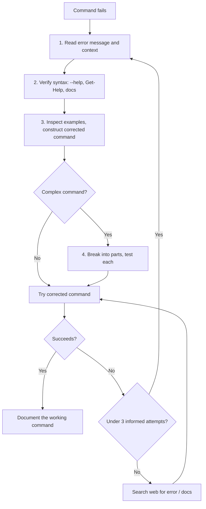

# Debugging

Debugging in this repo relies on forensic log files, structured logging helpers, and a disciplined approach to command failures and rate limits. The investigation and command-failure policies live in `.agents/rules/practices.md`.

## Forensic log files

Every composed orchestration run produces a forensic log file at the repo root with a name of the form:

```
gh-init-<slug>-<UTC-timestamp>.log
```

For example: `gh-init-nam20485-gap-miner-v2-tango57-20250724T153012Z.log`.

The file is created by `Initialize-LogFile` in `.agents/skills/gh-issue-tracking-init/scripts/common.ps1`. It begins with a metadata header that records everything needed for post-execution forensics:

- The UTC timestamp of the run
- The repository identity (owner/repo)
- The local working-copy path
- The checked-out git rev and ref
- The skill's own script directory
- The OS and PowerShell version

The log file path is stored in the `$env:GHIT_LOG_FILE` environment variable so that every subsequently dot-sourced operation script writes to the same file, even though each script has its own `$script:` scope.

## Logging helpers

The helpers in `common.ps1` provide color-coded console output that is simultaneously written to the forensic log:

| Helper | Console color | Log tag | Purpose |
|---|---|---|---|
| `Write-Log` | (log only) | `[<Op>]` | Appends a timestamped line silently |
| `Write-Step` | Cyan | `[STEP]` | Announces a major operation step |
| `Write-Ok` | Green | `[OK]` | Reports a successful completion |
| `Write-DryRun` | Yellow | `[DRYRUN]` | Marks dry-run-mode output |
| `Write-Skip` | Dark Gray | `[SKIP]` | Notes an idempotent skip |

Every log line follows the format `<HH:mm:ss.fffZ> [<Op>] <Message>`, so you can reconstruct the exact timing and sequence of a run by reading the log file after the fact.

The `Invoke-Gh` wrapper around the GitHub CLI logs every call it makes:

```
14:32:01.234Z [gh] INVOKING: gh issue create --title "..."
14:32:03.891Z [gh] OK (exit 0): gh issue create --title "..."
```

On failure it records the exit code before throwing:

```
14:32:05.112Z [gh] FAILED (exit 1): gh issue create --title "..."
```

## Fail-fast behavior

All scripts set `$ErrorActionPreference = 'Stop'` at the top. This means any cmdlet error becomes a terminating exception that halts the script immediately. Scripts use `throw` for fatal errors rather than `Write-Error` followed by `exit 1`. This makes failures loud and unambiguous: if something goes wrong, the script stops at the exact point of failure, and the forensic log captures where.

See [Patterns and conventions](patterns-and-conventions.md) for more on the error-handling style.

## GitHub API rate limits

The GitHub CLI talks to two different API surfaces with different rate limit budgets:

- **REST API** has a core limit of 5000 requests per hour per authenticated user.
- **GraphQL API** has a 5000-point budget per hour, but point costs vary by query complexity. The GraphQL Search API in particular consumes points aggressively and is more susceptible to rate limiting.

This matters for scripts that enumerate issues. The `Find-IssueNumberByTitle` function in `common.ps1` deliberately uses the REST issues endpoint (`repos/$Repo/issues?state=all&per_page=100&page=N`) instead of `gh issue list --search`, because the latter routes through the GraphQL Search API. When you are debugging a run that died with a rate limit error, check which API surface the failing call used.

## CLI error triage

When a CLI command fails, do not retry the same command. Follow this sequence:



Key principles:

- Read the error message carefully for hints before doing anything else.
- Verify the command syntax against `--help`, `Get-Help`, or the tool's documentation.
- For complex commands, break them into smaller parts and test each part in isolation.
- After at most 3 informed attempts, search the web for the error message or documentation before retrying again.
- Once you find a working command, document it where future runs can find it.

## Related pages

- [Development workflow](development-workflow.md) - orientation, planning, and making changes
- [Tooling](tooling.md) - the MCP tools available for investigation
- [Patterns and conventions](patterns-and-conventions.md) - error handling and fail-fast style
