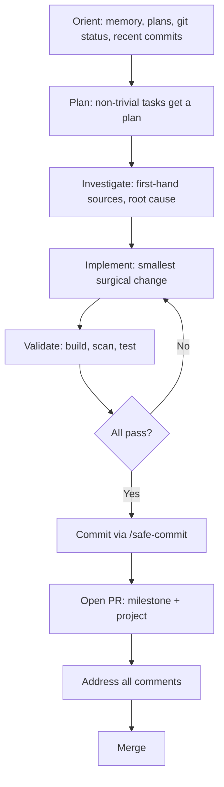

# Development workflow

The disciplined cycle this repo follows: orient to context, plan before acting, investigate root causes, make the smallest surgical change, validate, and ship through a pull request. The full policy lives in `.agents/rules/practices.md`.

## The cycle at a glance

## Orientation

Do not start any work without understanding the history and context first. Inspect the following:

- **Memory knowledge-graph** - query with `memory_search_nodes` to find relevant entities by keyword, `memory_read_graph` to browse the whole graph, and `memory_open_nodes` to open specific entities.
- **Memory context file** - read `.agents/memory.md` for Current Activity, Completed Work Items, Decisions, and Remember To Do.
- **Plans** - glob and read `plan_docs/`, `docs/plans/`, and `docs/` for existing plans, specs, and design docs relevant to the task.
- **Uncommitted changes** - run `git status` and `git diff` to see pending work in the working directory.
- **Recent commits** - run `git log --oneline -10` to see the latest work and conventions on the current branch.

See [How to contribute](index.md) for how work items are tracked in memory.

## Planning

Create a plan before starting any non-trivial task. A task is non-trivial when it involves three or more steps or roughly five minutes of work. Present the plan for approval before implementing. Use TODO lists to track work and mark items complete as you finish them.

### Think before coding

Before writing any code, apply these checks:

- State your assumptions explicitly. If uncertain, ask.
- If multiple interpretations exist, present them. Do not pick silently.
- If a simpler approach exists, say so. Push back when warranted.
- If something is unclear, stop. Name what is confusing and ask.

## Investigation

Never guess at the cause of an issue. Always investigate using first-hand sources: logs, code, and output. Do not report assertions without specific details (line numbers, files, log messages) to back them up. Do not start implementing a solution until you have decisively found the root cause.

## Making changes

Touch only what you must. Clean up only your own mess.

- Make the smallest, most surgical change possible.
- Only make changes necessary to fix the issue at hand.
- Ignore areas not relevant to the current task.
- Do not "improve" adjacent code, comments, or formatting.
- Do not refactor things that are not broken.
- Match existing style, even if you would do it differently.
- If you notice unrelated dead code, mention it. Do not delete it.

When your changes create orphans, remove imports, variables, and functions that your changes made unused. Do not remove pre-existing dead code unless asked. Every changed line should trace directly to the user's request.

## Handling command failures

When a CLI command fails, do not retry blindly. Follow this triage sequence before retrying:

1. Read the error message and its context for hints.
2. Verify command syntax with `--help`, `Get-Help`, or tool docs.
3. Inspect usage examples and construct a corrected command from careful analysis.
4. For complex commands, break them into smaller parts and test each part.

If the command still fails after up to 3 informed attempts, search the web for the error message or docs before retrying again. Once a working command is found, document it where appropriate for future runs.

For exit-code checks: use `$?` in bash or `$LASTEXITCODE` in PowerShell for native-command exit codes.

See [Debugging](debugging.md) for the forensic logging and rate-limit handling that complement this triage pattern.

## Related pages

- [How to contribute](index.md) - PR process, review expectations, definition of done
- [Debugging](debugging.md) - forensic logs, logging helpers, and CLI error triage
- [Testing](testing.md) - how to run validation and tests
- [Patterns and conventions](patterns-and-conventions.md) - coding style and idempotency
