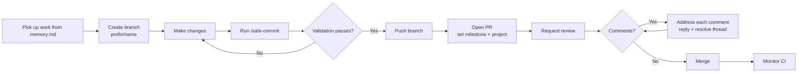

# How to contribute

This repository is a GitHub template, so contributing means improving the substrate that every downstream clone inherits. The rules are straightforward: orient before you start, branch per change, validate before you commit, and open a pull request that clears review and CI.

## Picking up work

Start by reading `.agents/memory.md`. Its **Current Activity** section lists the active project and in-progress work items. The **Remember To Do** section holds deferred tasks and future changes that become candidates when current work wraps up. Move items to **Completed Work Items** as you finish them, and update the file as you go rather than waiting until the end.

For the broader history and design decisions behind the work, the **Decisions** section in the same file records trade-off rationale so you do not have to rediscover it.

See [Memory and rules system](../systems/memory-and-rules.md) for how the `.agents/` directory is organized.

## Branching

Create a new branch for each feature or bug fix. Branch names use the form `<prefix>/<name>`, for example `mn/new-feature` or `dev/fix-bug`. The prefix identifies the branch lineage and the name describes the work. This convention is documented in `.agents/rules/source-control.md`.

## Committing

Always run the `/safe-commit` skill before committing. The skill enforces the validation discipline: build, scan, and test must all pass before a commit is created. After pushing, monitor the CI workflows and investigate any failure before moving on. Repeat until all workflows are green.

See [Testing](testing.md) for how to run validation locally and [Tooling](tooling.md) for what each validation step checks.

## Pull requests

Every branch gets a pull request with a descriptive title and description. Two fields are mandatory on every PR:

- **Milestone** - always set one when creating the PR.
- **Project** - always assign the PR to the active Projects v2 board.

Request a review from the appropriate team member. Once reviewers leave comments, the rule is simple: **address all comments before merging**. For each comment you resolve, leave a reply explaining the resolution and mark the thread as RESOLVED. Do not merge with unresolved threads.

## Definition of done

A change is complete when all of the following are true:

1. `./validation.ps1` passes locally (build, scan, test).
2. Test coverage is above the 85% gate.
3. CI passes on the PR.
4. All review comments are addressed and their threads resolved.
5. The relevant entry in `.agents/memory.md` is moved to **Completed Work Items**.

## Related pages

- [Development workflow](development-workflow.md) - the full branch, code, test, PR, merge cycle
- [Testing](testing.md) - Pester test suite, coverage, and TDD
- [Patterns and conventions](patterns-and-conventions.md) - coding style, idempotency, and naming
- [Validation pipeline](../systems/validation-pipeline.md) - what `validation.ps1` checks
