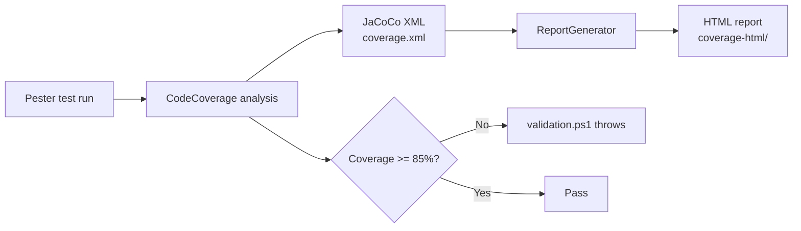

# Testing

This repo uses Pester to test the PowerShell scripts in the `gh-issue-tracking-init` skill. The suite has 190 tests across six test files and runs at 93.91% code coverage. An 85% coverage gate is enforced both locally by `validation.ps1` and in CI. The testing policy lives in `.agents/rules/validation.md`.

## Test framework

[Pester](https://pester.dev/) is the test framework. The repo requires Pester 5.0.0 or newer. Tests use mock functions to isolate GitHub CLI calls so no live API access is needed to run the suite.

## Test files

All test files live under `.agents/skills/gh-issue-tracking-init/scripts/tests/` and follow the `*.Tests.ps1` naming convention. There are six test files:

| File | What it covers |
|---|---|
| `AssertNoSecrets.Tests.ps1` | The secret-scanning assertion script |
| `EnsureIssueAndProject.Tests.ps1` | Issue creation and project board assignment |
| `GhIssueTracking.Tests.ps1` | Core skill orchestration and plan parsing |
| `ImportLabels.Tests.ps1` | Label sync logic (idempotent create and update) |
| `MilestonesAndLinks.Tests.ps1` | Milestone creation and sub-issue linking |
| `SetProjectFields.Tests.ps1` | Projects v2 board field updates |

## Running tests

Run the full suite with verbose output:

```pwsh
Invoke-Pester -Path .agents/skills/gh-issue-tracking-init/scripts/tests -Output Detailed
```

Or run the whole validation pipeline (build, scan, test) which includes the test step:

```pwsh
./validation.ps1 -Step test
```

To run a single test file:

```pwsh
Invoke-Pester -Path .agents/skills/gh-issue-tracking-init/scripts/tests/ImportLabels.Tests.ps1 -Output Detailed
```

## Coverage

Coverage is measured by Pester's built-in CodeCoverage feature. The configuration in `validation.ps1` targets the entire `scripts/` directory of the skill and outputs results in two formats:

- **JaCoCo XML** written to `coverage.xml` at the repo root. This is the machine-readable format consumed by CI and coverage tools.
- **HTML report** generated by [ReportGenerator](https://github.com/danielpalme/ReportGenerator) into `coverage-html/`. Open `coverage-html/index.html` in a browser to browse coverage by file and line.

The coverage threshold defaults to 85%. If coverage falls below that, `validation.ps1` throws and halts:

```
Coverage 83.5% is below threshold 85% (need 1234 executed, have 1200)
```

Current coverage is 93.91%, which gives headroom for new code before hitting the gate.



## Test-driven development

When implementing new features, follow TDD:

1. Write a failing test that covers the required functionality.
2. Implement the minimum change to make the test pass.
3. Iterate: add more tests and implementation until the feature is complete.

This keeps coverage high by construction and ensures each behavior has a test before the implementation exists.

## Related pages

- [Tooling](tooling.md) - linters, scanners, and coverage tools in the pipeline
- [Validation pipeline](../systems/validation-pipeline.md) - the build, scan, test steps in detail
- [Patterns and conventions](patterns-and-conventions.md) - error handling and fail-fast style
- [How to contribute](index.md) - definition of done and the commit workflow
