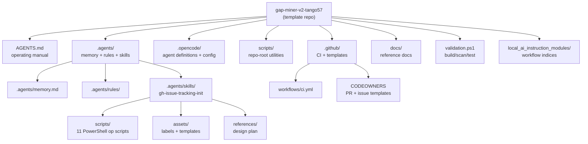
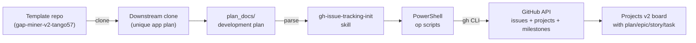
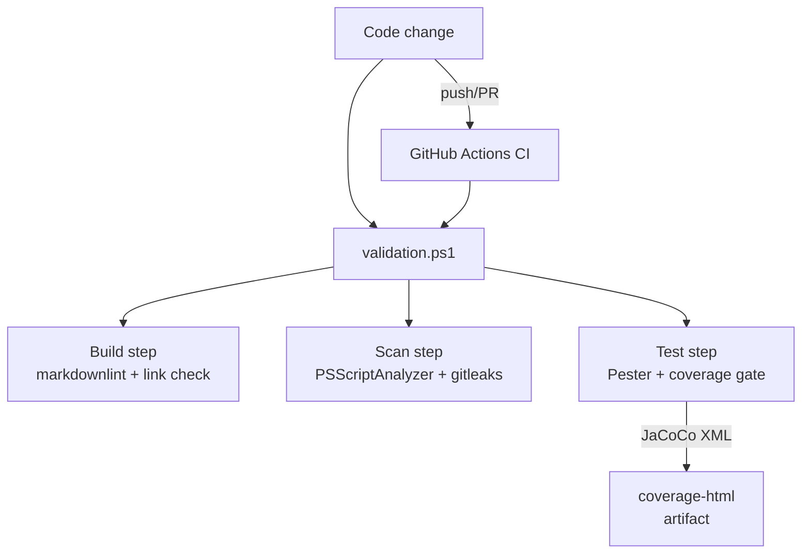

# Architecture

The repository is a template that downstream clones inherit. It has no runtime service or build artifacts in the traditional sense. Instead, it provides configuration, documentation, and PowerShell scripts that agents use to manage GitHub-based development workflows.

## Component map

## Data flow: template to working clone

The core flow: a downstream clone is created from this template, a development plan is placed in `plan_docs/`, and the `gh-issue-tracking-init` skill parses the plan into a hierarchy of linked GitHub issues with milestones, labels, and a Projects v2 board.

## Data flow: validation pipeline

The validation pipeline runs three steps in sequence: build (markdown linting and link checking), scan (static analysis and secret scanning), and test (Pester with an 85% coverage gate and HTML report generation). The CI workflow mirrors this exactly.

## Technology choices

The repo standardizes on cross-platform PowerShell 7+ for all scripting. This is documented in [.agents/rules/coding-style.md](../../.agents/rules/coding-style.md) and enforced by convention. The GitHub CLI (`gh`) is the primary interface to GitHub APIs, with PowerShell scripts wrapping `gh` calls for idempotent operations.

Language breakdown: 60 Markdown files, 25 PowerShell scripts, 5 YAML configs, and a handful of JSON/TOML config files. There is no compiled code, no frontend, and no database.

## Key design principles

1. **Determinism over convenience** - Skills prefer scripts over prose steps so they produce the same output every run.
2. **Self-contained skills** - The `gh-issue-tracking-init` skill vendors its dependencies and works unmodified when copied to another repo.
3. **Idempotent operations** - All scripts match existing resources and skip or update rather than duplicate.
4. **Validation mirrors CI** - `validation.ps1` at the repo root runs the same steps as the CI pipeline.
