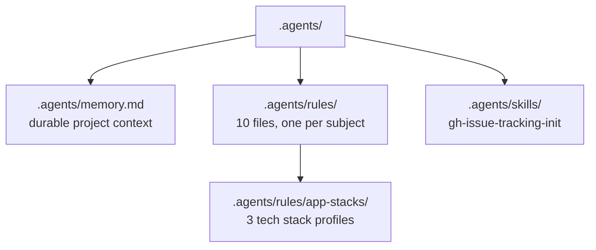

# Memory and rules system

nam20485

The `.agents/` directory is the single source of truth for project-specific decisions, conventions, and history. It has three parts: a memory file for durable context, a rules directory with one file per subject, and a skills directory. Every AI agent working in this repo is instructed to consult `.agents/` before starting work and to update it as progress is made.

## Directory structure

## memory.md

The file `.agents/memory.md` holds the project's durable context across sessions. It has four sections:

| Section | Purpose |
| --- | --- |
| **Current Activity** | The active project and its in-progress work items. Items move to Completed Work Items when done. |
| **Completed Work Items** | Finished work, organized by project, with dates and commit references. |
| **Decisions** | Design decisions, trade-off choices, and their rationale. |
| **Remember To Do** | Deferred tasks and future changes to plan when current work is done. |

The discipline is to update as you go, never wait until all work is done. As you progress, update the Current Activity section. When a work item is finished, move it to Completed Work Items. When an entire project is complete, move the Project header down. This keeps the memory file accurate at every commit, not just at milestones.

## rules/

The `.agents/rules/` directory contains ten files, one per subject. Each file is the authoritative source for its topic, and `AGENTS.md` links to it with a brief summary rather than duplicating the content. This keeps `AGENTS.md` short while the detailed rules remain centralized and editable in one place.

| Rules file | Purpose |
| --- | --- |
| `.agents/rules/tools.md` | Tool guidance: Sequential-Thinking for structured reasoning, Memory knowledge-graph for durable context, Semantic Search for codebase indexing, Z.AI MCP for web and repo research, Exa MCP for neural search. |
| `.agents/rules/validation.md` | Validation policy: three steps (build, scan, test), automated test suite maintenance, TDD guidance, and the >85% coverage requirement. |
| `.agents/rules/source-control.md` | Source control rules: run `/safe-commit` before committing, monitor CI workflows after pushing, branching convention (`<base-branch-prefix>/<branch-name>`), and pull request lifecycle including milestone and project assignment. |
| `.agents/rules/delegation.md` | Delegation and orchestration: delegate to the appropriate subagent, prefer parallel agents, and pick the smallest coordination layer that fits the scope. |
| `.agents/rules/practices.md` | The engineering lifecycle: orient to project history before starting, plan non-trivial tasks, investigate root causes with first-hand sources, and make the smallest surgical changes possible. |
| `.agents/rules/coding-style.md` | Coding conventions: cross-platform PowerShell 7+ as the default scripting language, Simplicity First (minimum code that solves the problem), and Goal-Driven Execution (define success criteria, loop until verified). |
| `.agents/rules/skills.md` | Skill creation conventions: strict compliance with the Agent Skills specification, standard directory layout, and prefer scripts over prose for repeatable operations. |
| `.agents/rules/scripts.md` | Repository scripts inventory: the seven scripts under `scripts/`, their purposes and key parameters, common conventions, and how to generate a labels export. |
| `.agents/rules/ci-cd.md` | CI/CD pipeline requirements: mandatory test, coverage, and scanning steps, >85% coverage threshold, HTML coverage report as artifact, and SHA-pinned GitHub Actions. |
| `.agents/rules/ai-instructions-modules.md` | Remote canonical module lookup: the two `local_ai_instruction_modules/` index files, how `scripts/update-remote-indices.ps1` refreshes them, and the hard-coded path constraint. |

## The brief-with-link pattern

When content is relocated from `AGENTS.md` into a rules file, the `AGENTS.md` section that replaces it does not just vanish. It becomes a two-part brief:

1. **Title** - a heading describing the type of content the linked file holds (not just its subject name).
2. **Summary** - a one or two line summary previewing the most important actual items from the file, abbreviated in context.

For example, the `AGENTS.md` section for coding style reads as a brief titled "Coding Style Discipline" with a summary mentioning the core rules (minimum code, verifiable success criteria, loop until verified), followed by a link to `.agents/rules/coding-style.md` for the full detail. This pattern means an agent skimming `AGENTS.md` gets enough context to know whether it needs to open the rules file, without the rules file's content being duplicated in two places.

## skills/

The `.agents/skills/` directory holds the `gh-issue-tracking-init` skill, the repo's flagship capability. It is a self-contained directory with its own `scripts/`, `assets/`, and `references/` subdirectories, documented separately on the [gh-issue-tracking-init](../features/gh-issue-tracking-init/index.md) page. Skill creation conventions are governed by `.agents/rules/skills.md`, which mandates compliance with the Agent Skills specification.

## Key source files

| Path | What it contains |
| --- | --- |
| `.agents/memory.md` | Project memory with four sections (Current Activity, Completed Work Items, Decisions, Remember To Do) |
| `.agents/rules/tools.md` | Tool guidance and decision points |
| `.agents/rules/validation.md` | Validation, testing, and TDD policy |
| `.agents/rules/source-control.md` | Safe commit, branching, and pull request rules |
| `.agents/rules/delegation.md` | Delegation and orchestration rules |
| `.agents/rules/practices.md` | Orientation, planning, investigation, and change lifecycle |
| `.agents/rules/coding-style.md` | PowerShell default, Simplicity First, Goal-Driven Execution |
| `.agents/rules/skills.md` | Skill creation conventions and spec compliance |
| `.agents/rules/scripts.md` | Repository scripts inventory |
| `.agents/rules/ci-cd.md` | CI/CD pipeline requirements and SHA pinning |
| `.agents/rules/ai-instructions-modules.md` | Remote canonical module lookup tables |
| `AGENTS.md` | The operating manual that links to all rules files with briefs |

## Related pages

- [Systems](index.md)
- [agent-context overview](../overview/index.md)
- [Features](../features/index.md)
- [Agent definitions](../features/agent-definitions.md)
- [Patterns and conventions](../how-to-contribute/patterns-and-conventions.md)
