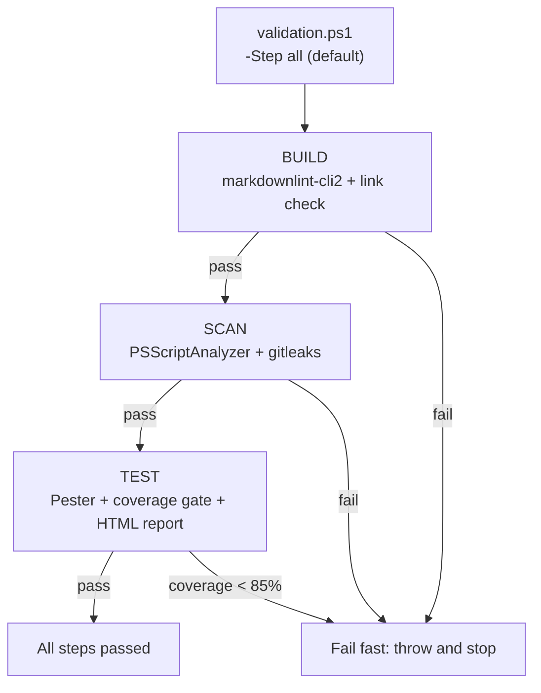

# Validation pipeline

nam20485

Every change in this repo passes through a three-step validation pipeline: build, scan, and test. The pipeline is defined once in `validation.ps1` at the repo root and mirrored exactly by the GitHub Actions workflow at `.github/workflows/ci.yml`. Running `./validation.ps1` locally gives you the same result CI will produce, so there are no surprises after pushing.

## The three steps



### Build

The build step runs `markdownlint-cli2` across the repo using the scoped configuration in `.markdownlint-cli2.jsonc`, which lints 18 docs-of-record files and excludes plan and issue templates that contain intentional placeholder syntax. After linting, the step validates every relative Markdown link in `README.md` and `AGENTS.md` by resolving each path against the filesystem. Any broken link causes a failure with the file and link path listed.

### Scan

The scan step runs two tools:

1. **PSScriptAnalyzer** (version 1.20.0 or later) scans two directories: `.agents/skills/gh-issue-tracking-init/scripts` and `scripts`. Findings at Error severity are blocking and fail the step. Findings at Warning severity are reported but non-blocking.
2. **gitleaks** runs `detect` mode across the whole repo using the `.gitleaks.toml` config, which allowlists the two intentional fake-secret fixtures in the test suite. Any secret leak fails the step.

### Test

The test step runs the Pester suite (version 5.0.0 or later) against `.agents/skills/gh-issue-tracking-init/scripts/tests` with code coverage enabled on the `.agents/skills/gh-issue-tracking-init/scripts` directory. Coverage is emitted in JaCoCo XML format to `coverage.xml`. The step enforces a coverage gate: if coverage falls below the threshold (default 85%, configurable via `-CoverageThreshold`), the step fails and reports how many additional commands need to be executed to reach the threshold.

After the gate passes, the step generates an HTML coverage report using ReportGenerator (`dotnet-reportgenerator-globaltool` version 5.5.10) into the `coverage-html/` directory. This can be skipped with `-SkipHtml`.

Current state: 190 Pester tests, 0 failures, 93.91% coverage (802 of 854 commands covered).

## Running validation locally

```pwsh
# Run all three steps (default)
./validation.ps1

# Run a single step
./validation.ps1 -Step build
./validation.ps1 -Step scan
./validation.ps1 -Step test

# Raise the coverage threshold and skip HTML report
./validation.ps1 -CoverageThreshold 90 -SkipHtml
```

The script sets `$ErrorActionPreference = 'Stop'` and each step throws on failure, so the pipeline stops at the first failing step rather than continuing.

## CI mirrors local validation

The workflow at `.github/workflows/ci.yml` runs on every push to `development` and `main`, and on every pull request. It installs the same tools the local script expects (markdownlint-cli2 0.22.1, gitleaks 8.21.2, plus PowerShell modules and the .NET ReportGenerator tool on demand), then runs `./validation.ps1` with the `pwsh` shell. The HTML coverage report is uploaded as an artifact using `actions/upload-artifact` with `if: always()`, so the report is available even if the test step fails.

A full CI run completes in about 32 seconds.

## SHA-pinned actions

Both `uses:` lines in the workflow reference full 40-character commit SHAs, not mutable tags. This is a mandatory rule from `.agents/rules/ci-cd.md`: tag refs like `@v4` or `@main` are prohibited because they are a supply-chain attack vector. Each line includes a trailing `# vX.Y.Z` comment for readability.

| Action | SHA | Version comment |
| --- | --- | --- |
| `actions/checkout` | `3d3c42e5aac5ba805825da76410c181273ba90b1` | v7.0.1 |
| `actions/upload-artifact` | `043fb46d1a93c77aae656e7c1c64a875d1fc6a0a` | v7.0.1 |

## Why gitleaks binary instead of the action

The CI workflow downloads the gitleaks binary directly rather than using `gitleaks/gitleaks-action`. The action requires a paid `GITHUB_TOKEN` with a `GITLEAKS_LICENSE` for organization repos like `nam20485`. The binary is free and functionally identical for `detect` mode. The `.gitleaks.toml` config allowlists the two intentional fake-secret test fixtures so they do not trigger false positives.

## Key source files

| Path | What it contains |
| --- | --- |
| `validation.ps1` | Root validation script with build, scan, and test steps |
| `.github/workflows/ci.yml` | CI pipeline that mirrors `validation.ps1` |
| `.agents/rules/validation.md` | Validation policy (three steps, testing, TDD, >85% coverage) |
| `.agents/rules/ci-cd.md` | CI/CD requirements (mandatory steps, SHA pinning, HTML report) |
| `.markdownlint-cli2.jsonc` | Scoped markdownlint configuration |
| `.gitleaks.toml` | Gitleaks config with fake-secret test fixture allowlist |

## Related pages

- [Systems](index.md)
- [Getting started](../overview/getting-started.md)
- [Architecture](../overview/architecture.md)
- [Memory and rules system](memory-and-rules.md)
- [Tooling](../how-to-contribute/tooling.md)
